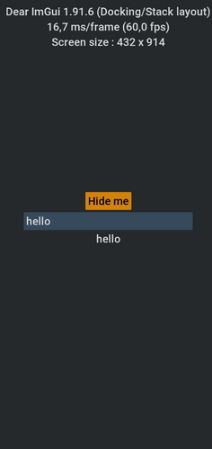
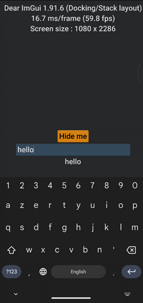

# imgui_destop_android

template project for desktop and android app with mostly common code

# Screenshots

|Desktop (Win10)|Android (Zenfone10)|
|--|--|
|||


# rename project

you need to rename in files :
- Project name in CMakeLists.txt
- com adress in android/app/src/main/AndroidManifest.xml
- com adress in android/app/build.gradle
- com adress in android/app/src/main/java/MainActivity.kt

for the android files, you can rename with massive files/replace in android studio

if not done, you can get issue when execution on android :

```
issue ex :
java.lang.RuntimeException: Unable to start activity ComponentInfo{com.org.imgui_destop_android/com.org.imgui_destop_android.MainActivity}: 
java.lang.IllegalArgumentException: Unable to find native library imgui_destop_android using classl ...
```

you can also unzip the apk here for check the lib name : android/app/build/intermediates/apk/<<Mode>>/app-debug.apk

# how to build

# win/linux/macos

nothing special to do

# android

just open android studio and open project at location ./android

when you change c++ code, you need in some case to file menu/refrech c++ files

